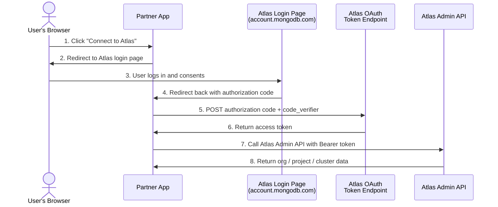

# MongoDB Atlas Partner API — Complete Guide

This guide explains what the Atlas Partner APIs are, how they work, how to get access, and how to call them using `curl` or the included FastAPI demo server.

---

## Table of Contents

1. [What Are the Partner APIs?](#what-are-the-partner-apis)
2. [Enable Delegated Partner Access](#enable-delegated-partner-access)
3. [Atlas API Reference](#atlas-api-reference)
4. [FastAPI Demo Server](#fastapi-demo-server)
5. [Troubleshooting](#troubleshooting)

---

# What Are the Partner APIs?

The **MongoDB Atlas Partner APIs** are a set of Atlas Admin API endpoints that a trusted third-party partner application can call on behalf of an Atlas user, without ever seeing that user's credentials.

A partner app might use these APIs to:

- **List the user's Organizations** — so the user can pick which org to connect to
- **Create a Project** inside that org — to provision a workspace for the user
- **Create a Cluster** — to spin up a database automatically
- **Monitor or delete Clusters** — to manage the database lifecycle

## Why is this different from a normal Atlas API call?

Normally, to call the Atlas Admin API you need an API key that belongs to the organization. With the Partner API model:

- The **user logs in** to Atlas in their browser (standard OAuth login).
- The partner app receives a short-lived **delegated access token** on behalf of that user.
- The partner app uses that token to call Atlas APIs **scoped to what the user is allowed to do** — no org-level API key needed.

This model follows the **OAuth 2.0 Authorization Code + PKCE** standard. The partner app never sees the user's password or holds long-lived credentials.

## How access works



## Two types of tokens

| Token type | Who uses it | How it is obtained |
|---|---|---|
| **Delegated user token** | Your app acting on behalf of a user | `authorization_code` + PKCE grant after user logs in |
| **Service Account token** | Your backend app (no user involved) | `client_credentials` grant using Client ID + Secret |


---

# Enable Delegated Partner Access

By default, an Atlas Organization blocks partner apps from accessing it. You must explicitly enable **Delegated Partner Access** before any partner token can call the Atlas Admin API for that Organization.

You only need to do this **once per Organization**. This step requires a **service account token**.

## Step 1 — Create a Service Account

1. Log in to the Atlas UI for your environment.
2. In the left sidebar click **Access Manager** → **Organization Access**.
3. Click the **Applications** tab → **Service Accounts** → **Add New Service Account**.
4. Name it (e.g. `partner-demo-sa`), set role to **Organization Owner**, click **Add Service Account**.
5. Copy the **Client ID** (`mdb_sa_id_...`) and **Client Secret** (`mdb_sa_sk_...`).

:::caution
The client secret is shown **only once**. Copy it immediately and store it securely.
:::

## Step 2 — Get a Service Account Token

```bash
CLOUD_BASE=https://cloud-dev.mongodb.com
SA_CLIENT_ID=mdb_sa_id_...
SA_CLIENT_SECRET=mdb_sa_sk_...

SA_TOKEN=$(curl -s -X POST "${CLOUD_BASE}/api/oauth/token" \
  -H "Content-Type: application/x-www-form-urlencoded" \
  -H "Authorization: Basic $(echo -n "${SA_CLIENT_ID}:${SA_CLIENT_SECRET}" | base64)" \
  -d "grant_type=client_credentials" | jq -r .access_token)

echo "Service account token: ${SA_TOKEN}"
```

Or using the Python script:

```bash
python3 oauthdemo/get_token.py \
  --client-id     mdb_sa_id_... \
  --client-secret mdb_sa_sk_...
```

## Step 3 — Check current setting

```bash
API_BASE=https://api-dev.mongodb.com
ORG_ID=<your-org-id>

curl -s "${API_BASE}/api/atlas/v2/orgs/${ORG_ID}/delegationSettings" \
  -H "Authorization: Bearer ${SA_TOKEN}" \
  -H "Accept: application/vnd.atlas.2025-03-12+json" | jq .
```

Default response (access blocked):

```json
{
  "delegatedPartnerAccess": "DISALLOWED"
}
```

## Step 4 — Enable READ_WRITE access

```bash
curl -s -X PATCH \
  "${API_BASE}/api/atlas/v2/orgs/${ORG_ID}/delegationSettings" \
  -H "Authorization: Bearer ${SA_TOKEN}" \
  -H "Accept: application/vnd.atlas.2025-03-12+json" \
  -H "Content-Type: application/vnd.atlas.2025-03-12+json" \
  -d '{"delegatedPartnerAccess": "READ_WRITE"}' | jq .
```

Expected response:

```json
{
  "delegatedPartnerAccess": "READ_WRITE"
}
```

Once set, any delegated user token obtained via the partner OAuth client can call the Atlas Admin API for this Organization.


---

# Atlas API Reference

All requests require:

```
Authorization: Bearer <access_token>
Accept: application/vnd.atlas.2025-03-12+json
```

Set these variables before running any command:

```bash
API_BASE=https://api-dev.mongodb.com
ORG_ID=<your-org-id>
PROJECT_ID=<your-project-id>
CLUSTER_NAME=<your-cluster-name>

ACCESS_TOKEN=$(python3 -c \
  "import json; print(json.load(open('oauthdemo/.token_store.json'))['access_token'])")
```

---

## List Organizations

Returns all Atlas Organizations the user belongs to that have Delegated Partner Access enabled.

```bash
curl -s "${API_BASE}/api/atlas/v2/orgs" \
  -H "Authorization: Bearer ${ACCESS_TOKEN}" \
  -H "Accept: application/vnd.atlas.2025-03-12+json" | jq .
```

Filter by name:

```bash
curl -s "${API_BASE}/api/atlas/v2/orgs?name=Acme" \
  -H "Authorization: Bearer ${ACCESS_TOKEN}" \
  -H "Accept: application/vnd.atlas.2025-03-12+json" | jq .
```

<details>
<summary>Python example</summary>

```python
import json, urllib.request

API_BASE     = "https://api-dev.mongodb.com"
ACCESS_TOKEN = json.load(open("oauthdemo/.token_store.json"))["access_token"]

req = urllib.request.Request(
    f"{API_BASE}/api/atlas/v2/orgs",
    headers={
        "Authorization": f"Bearer {ACCESS_TOKEN}",
        "Accept": "application/vnd.atlas.2025-03-12+json",
    },
)
with urllib.request.urlopen(req) as resp:
    print(json.dumps(json.loads(resp.read()), indent=2))
```

</details>

---

## List Projects in an Organization

```bash
curl -s "${API_BASE}/api/atlas/v2/groups?orgId=${ORG_ID}" \
  -H "Authorization: Bearer ${ACCESS_TOKEN}" \
  -H "Accept: application/vnd.atlas.2025-03-12+json" | jq .
```

---

## Create a Project

```bash
curl -s -X POST "${API_BASE}/api/atlas/v2/groups" \
  -H "Authorization: Bearer ${ACCESS_TOKEN}" \
  -H "Accept: application/vnd.atlas.2025-03-12+json" \
  -H "Content-Type: application/vnd.atlas.2025-03-12+json" \
  -d "{\"name\": \"my-project\", \"orgId\": \"${ORG_ID}\"}" | jq .
```

Copy the `id` field from the response — this is your `PROJECT_ID`.

<details>
<summary>Python example</summary>

```python
import json, urllib.request

payload = json.dumps({"name": "my-project", "orgId": ORG_ID}).encode()
req = urllib.request.Request(
    f"{API_BASE}/api/atlas/v2/groups",
    data=payload,
    method="POST",
    headers={
        "Authorization": f"Bearer {ACCESS_TOKEN}",
        "Accept": "application/vnd.atlas.2025-03-12+json",
        "Content-Type": "application/vnd.atlas.2025-03-12+json",
    },
)
with urllib.request.urlopen(req) as resp:
    print(json.dumps(json.loads(resp.read()), indent=2))
```

</details>

---

## Create a Cluster

Creates a free **M0** cluster (shared, no charge). Change `instanceSize` to `M10` or higher for dedicated clusters.

```bash
curl -s -X POST "${API_BASE}/api/atlas/v2/groups/${PROJECT_ID}/clusters" \
  -H "Authorization: Bearer ${ACCESS_TOKEN}" \
  -H "Accept: application/vnd.atlas.2025-03-12+json" \
  -H "Content-Type: application/vnd.atlas.2025-03-12+json" \
  -d '{
    "name": "'"${CLUSTER_NAME}"'",
    "clusterType": "REPLICASET",
    "replicationSpecs": [{
      "regionConfigs": [{
        "providerName": "TENANT",
        "backingProviderName": "AWS",
        "regionName": "US_EAST_1",
        "priority": 7,
        "electableSpecs": { "instanceSize": "M0" }
      }]
    }]
  }' | jq .
```

Available cluster options:

| Field | Options | Default |
|---|---|---|
| `backingProviderName` | `AWS`, `GCP`, `AZURE` | `AWS` |
| `regionName` | `US_EAST_1`, `EU_WEST_1`, `AP_SOUTHEAST_1`, etc. | `US_EAST_1` |
| `instanceSize` | `M0` (free), `M10`, `M20`, `M30`, … | `M0` |

---

## Get Cluster Status

```bash
curl -s "${API_BASE}/api/atlas/v2/groups/${PROJECT_ID}/clusters/${CLUSTER_NAME}" \
  -H "Authorization: Bearer ${ACCESS_TOKEN}" \
  -H "Accept: application/vnd.atlas.2025-03-12+json" | jq .stateName
```

| `stateName` | Meaning |
|---|---|
| `CREATING` | Cluster is being provisioned |
| `IDLE` | Cluster is running and ready |
| `UPDATING` | Configuration change in progress |
| `DELETING` | Cluster is being deleted |
| `DELETED` | Cluster no longer exists |

Poll until ready:

```bash
until [ "$(curl -s "${API_BASE}/api/atlas/v2/groups/${PROJECT_ID}/clusters/${CLUSTER_NAME}" \
  -H "Authorization: Bearer ${ACCESS_TOKEN}" \
  -H "Accept: application/vnd.atlas.2025-03-12+json" | jq -r .stateName)" = "IDLE" ]; do
  echo "Waiting for cluster..."; sleep 15
done
echo "Cluster is ready."
```

---

## Delete a Cluster

:::danger
Deletion is **permanent and irreversible**. The cluster moves to `DELETING` state and disappears after a few minutes.
:::

```bash
curl -s -X DELETE \
  "${API_BASE}/api/atlas/v2/groups/${PROJECT_ID}/clusters/${CLUSTER_NAME}" \
  -H "Authorization: Bearer ${ACCESS_TOKEN}" \
  -H "Accept: application/vnd.atlas.2025-03-12+json" | jq .
```


---

# FastAPI Demo Server

`api.py` is a local FastAPI proxy that wraps the Atlas Admin API. It reads the access token automatically from `oauthdemo/.token_store.json` so you do not need to pass `Authorization` headers in every request.

## Setup

```bash
cd oauthdemo
python3 -m venv .venv
source .venv/bin/activate     # Windows: .venv\Scripts\activate
pip install -r requirements.txt
```

## Start the server

```bash
# Step 1 — authenticate (from repo root)
python3 oauthdemo/get_token.py

# Step 2 — start the server (must run from oauthdemo/)
cd oauthdemo
source .venv/bin/activate
uvicorn api:app --reload --port 8080
```

Interactive API docs are available at: **http://localhost:8080/docs**

## Endpoints

| Method | Path | Description |
|---|---|---|
| `GET` | `/health` | Token store status and expiry |
| `POST` | `/auth/refresh` | Refresh access token |
| `GET` | `/orgs` | List Organizations |
| `GET` | `/orgs/{org_id}/projects` | List Projects in an Org |
| `POST` | `/projects` | Create a Project |
| `GET` | `/projects/{project_id}/clusters` | List Clusters in a Project |
| `POST` | `/projects/{project_id}/clusters` | Create a Cluster |
| `GET` | `/projects/{project_id}/clusters/{cluster_name}` | Get Cluster Status |
| `DELETE` | `/projects/{project_id}/clusters/{cluster_name}` | Delete a Cluster |

## curl examples

Set variables once:

```bash
BASE=http://localhost:8080
ORG_ID=<your-org-id>
PROJECT_ID=<your-project-id>
CLUSTER_NAME=<your-cluster-name>
```

**Health check:**
```bash
curl -s ${BASE}/health | jq .
```

**List Organizations:**
```bash
curl -s ${BASE}/orgs | jq .

# Filter by name
curl -s "${BASE}/orgs?name=Acme" | jq .
```

**List Projects:**
```bash
curl -s ${BASE}/orgs/${ORG_ID}/projects | jq .
```

**Create a Project:**
```bash
curl -s -X POST ${BASE}/projects \
  -H "Content-Type: application/json" \
  -d "{\"name\": \"my-project\", \"org_id\": \"${ORG_ID}\"}" | jq .
```

**Create a Cluster:**
```bash
curl -s -X POST ${BASE}/projects/${PROJECT_ID}/clusters \
  -H "Content-Type: application/json" \
  -d '{
    "name": "'"${CLUSTER_NAME}"'",
    "provider": "AWS",
    "region": "US_EAST_1",
    "instance_size": "M0"
  }' | jq .
```

**Get Cluster Status:**
```bash
curl -s ${BASE}/projects/${PROJECT_ID}/clusters/${CLUSTER_NAME} | jq .stateName
```

**Delete a Cluster:**
```bash
curl -s -X DELETE \
  ${BASE}/projects/${PROJECT_ID}/clusters/${CLUSTER_NAME} | jq .
```

**Refresh access token:**
```bash
# Use stored refresh token automatically
curl -s -X POST ${BASE}/auth/refresh | jq .

# Pass an explicit refresh token
curl -s -X POST ${BASE}/auth/refresh \
  -H "Content-Type: application/json" \
  -d '{"refresh_token": "<your-refresh-token>"}' | jq .
```

## Token expiry

When the token expires the server returns `401`. Re-run `get_token.py` — the server picks up the new token automatically on the next request:

```bash
python3 oauthdemo/get_token.py
```


---

# Troubleshooting

## Common errors

| Symptom | Cause | Fix |
|---|---|---|
| `Invalid request to preauthorize` | `client_id` or `redirect_uri` mismatch | `CLIENT_ID` in `.env` must exactly match the value MongoDB provisioned for that `redirect_uri` |
| `406 INVALID_VERSION_DATE` | Missing `Accept` header | Add `-H "Accept: application/vnd.atlas.2025-03-12+json"` to every Atlas API request |
| `401 Unauthorized` from Atlas API | Access token expired | Re-run `python3 oauthdemo/get_token.py` |
| `401` from FastAPI server | Token expired or not yet obtained | Re-run `python3 oauthdemo/get_token.py` |
| `405 Method Not Allowed` on `/authorize` | Wrong base URL used | Use `CLOUD_BASE` for `/oauth/authorize`, not `OAUTH_BASE` |
| `403 Forbidden` on Atlas API | Delegated Partner Access not enabled | See [Enable Delegated Partner Access](/partner-api-guide/enable-delegated-access) |
| `400 invalid_grant` | Authorization code already used or expired | Codes are single-use and short-lived — restart the auth flow |
| `400 grant_type not supported` | Refresh token used on a client that doesn't support it | This client was registered with `grant_types: [authorization_code]` only — re-run the browser flow |
| `Authentication failed (E0000004)` | Logged in with base email in dev | Use the tagged email: `you+mongodb.com@gmail.com` |
| `OSError: [Errno 48] Address already in use` | Port 3000 left open from a previous run | The script auto-frees the port on startup; or run `lsof -ti:3000 \| xargs kill -9` manually |
| `PermissionError: [Errno 13]` | Port below 1024 requires root | Use `--redirect-port 3000` or above |
| `Could not import module "api"` | uvicorn run from wrong directory | `cd oauthdemo` first, then run `uvicorn api:app` |
| Token not received after 5 minutes | Browser did not redirect to localhost | Re-run the script — PKCE state expired |

## Credential mismatch errors

The most common cause of `Invalid request to preauthorize` is using a `client_id` from one environment or provider with credentials from another:

- GitHub OAuth credentials **cannot** be used with `authorize.mongodb.com`
- Dev `client_id` values **cannot** be used against staging or production endpoints
- Each `client_id` is bound to specific `redirect_uri` values at registration time — these must match exactly

## Token debugging

Inspect a stored token without making any API calls:

```bash
# Check expiry
curl -s http://localhost:8080/health | jq .

# Decode the JWT payload (base64, no verification)
python3 -c "
import json, base64
token = open('oauthdemo/.token_store.json').read()
payload = json.loads(token)['access_token'].split('.')[1]
padding = 4 - len(payload) % 4
print(json.dumps(json.loads(base64.urlsafe_b64decode(payload + '='*padding)), indent=2))
"
```

