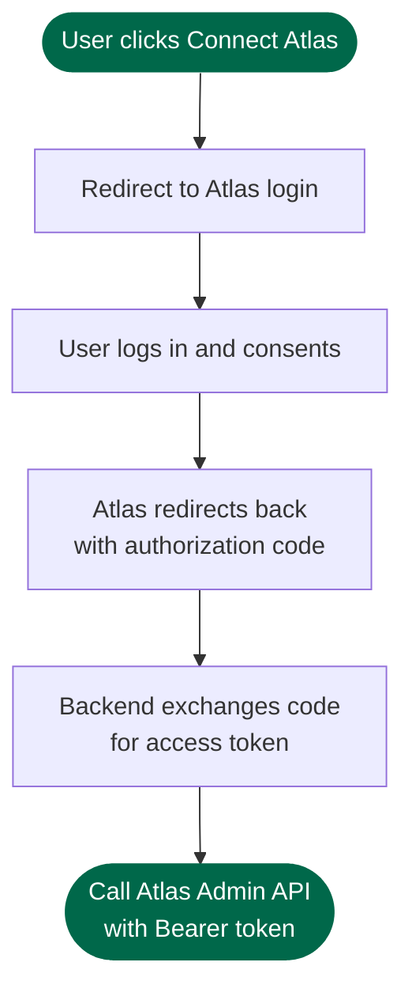

# MongoDB Atlas Partner API

The **MongoDB Atlas Partner API** lets trusted third-party applications call Atlas Admin API endpoints on behalf of an authenticated Atlas user — without ever seeing that user's credentials.

## What you can do

A partner app uses delegated OAuth tokens to:

- **List Organizations** the user belongs to
- **Create Projects** inside those organizations
- **Provision Clusters** — including free M0 clusters
- **Monitor and delete Clusters** throughout their lifecycle

## How it works

The flow follows **OAuth 2.0 Authorization Code + PKCE**. Your app never sees the user's password and holds only a short-lived access token.

## Environments

| Environment | Atlas UI | OAuth / Token | Atlas Admin API |
|---|---|---|---|
| **Dev** | https://cloud-dev.mongodb.com | https://authorize-dev.mongodb.com | https://api-dev.mongodb.com |
| **Staging** | https://cloud-stage.mongodb.com | https://authorize-stage.mongodb.com | https://api-stage.mongodb.com |
| **Production** | https://cloud.mongodb.com | https://authorize.mongodb.com | https://api.mongodb.com |

## Next steps

- [Getting Your OAuth Credentials](/getting-credentials) — how the current manual onboarding model works
- [Quick Start](/quick-start) — run the demo and get a token in minutes
- [Partner API Guide](/partner-api-guide/overview) — full end-to-end reference
- [Lovable Onboarding](/partner-onboarding/lovable) — partner-specific integration guide
