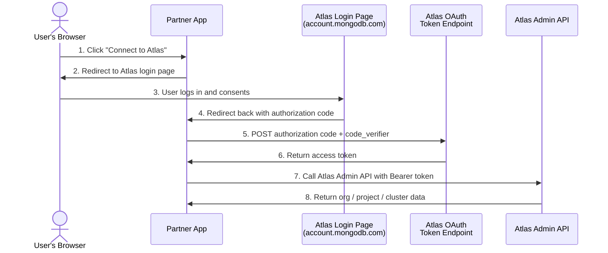

# What Are the Partner APIs?

The **MongoDB Atlas Partner APIs** are a set of Atlas Admin API endpoints that a trusted third-party partner application can call on behalf of an Atlas user, without ever seeing that user's credentials.

A partner app might use these APIs to:

- **List the user's Organizations** — so the user can pick which org to connect to
- **Create a Project** inside that org — to provision a workspace for the user
- **Create a Cluster** — to spin up a database automatically
- **Monitor or delete Clusters** — to manage the database lifecycle

## Why is this different from a normal Atlas API call?

Normally, to call the Atlas Admin API you need an API key that belongs to the organization. With the Partner API model:

- The **user logs in** to Atlas in their browser (standard OAuth login).
- The partner app receives a short-lived **delegated access token** on behalf of that user.
- The partner app uses that token to call Atlas APIs **scoped to what the user is allowed to do** — no org-level API key needed.

This model follows the **OAuth 2.0 Authorization Code + PKCE** standard. The partner app never sees the user's password or holds long-lived credentials.

## How access works

## Two types of tokens

| Token type | Who uses it | How it is obtained |
|---|---|---|
| **Delegated user token** | Your app acting on behalf of a user | `authorization_code` + PKCE grant after user logs in |
| **Service Account token** | Your backend app (no user involved) | `client_credentials` grant using Client ID + Secret |
